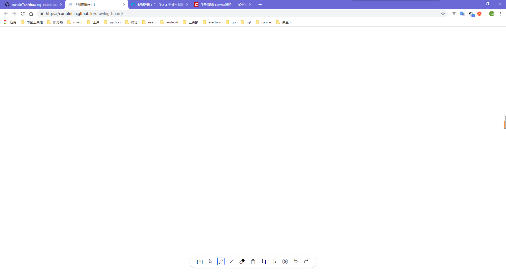
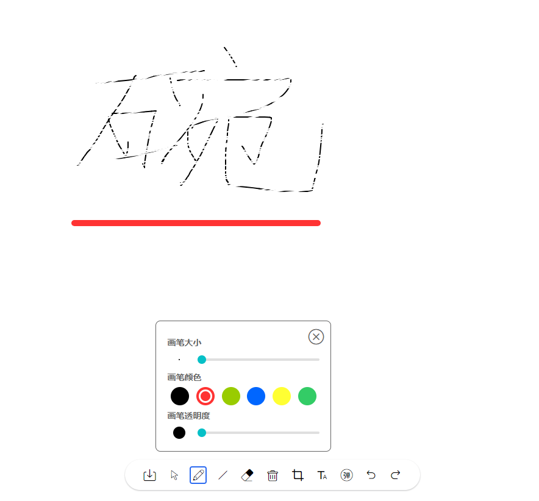
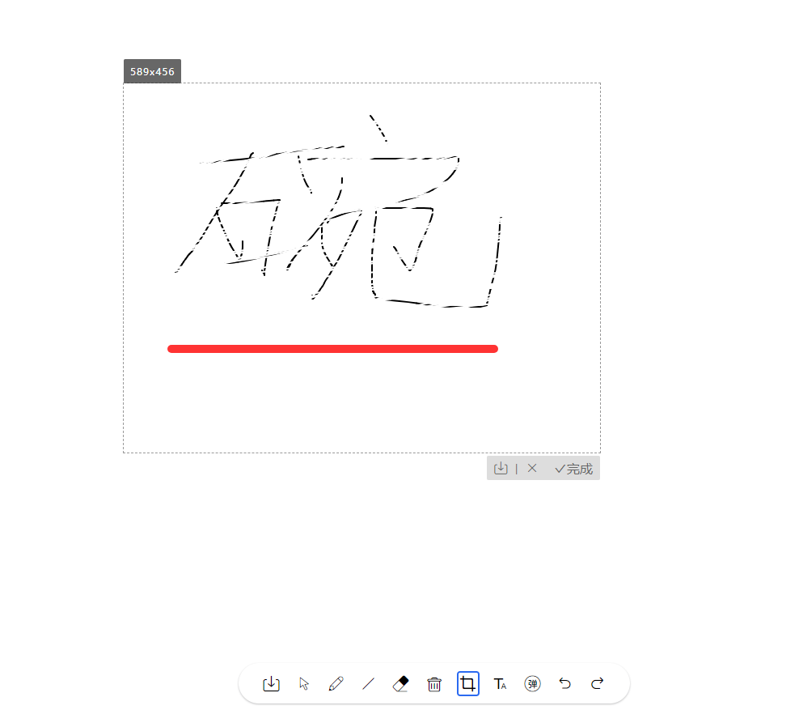
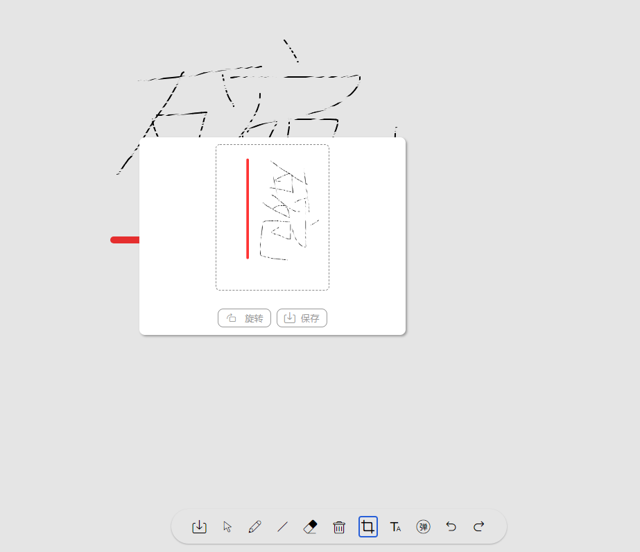
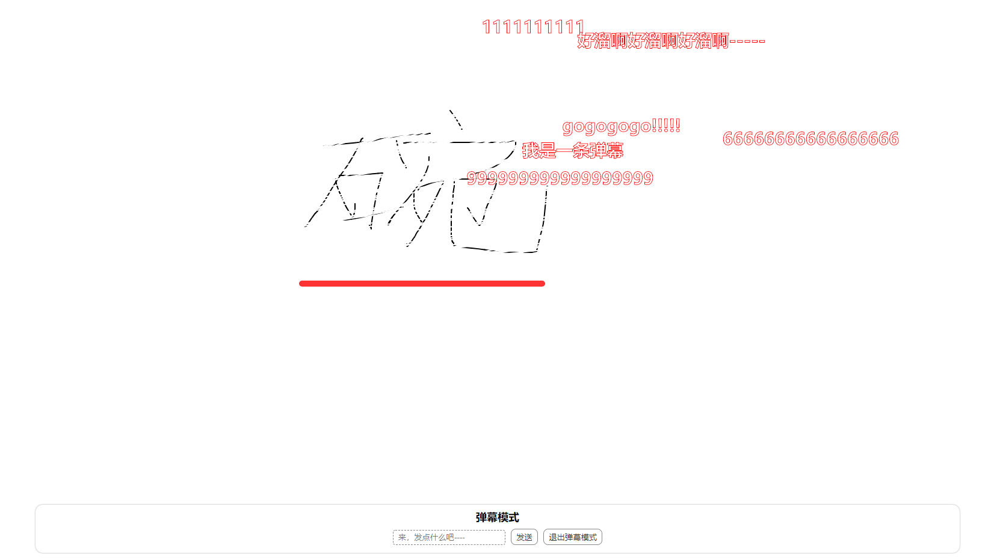
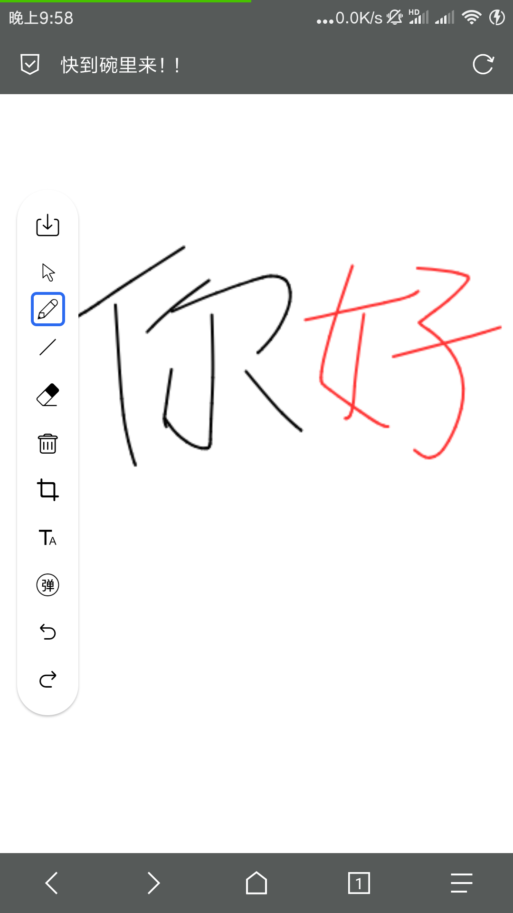
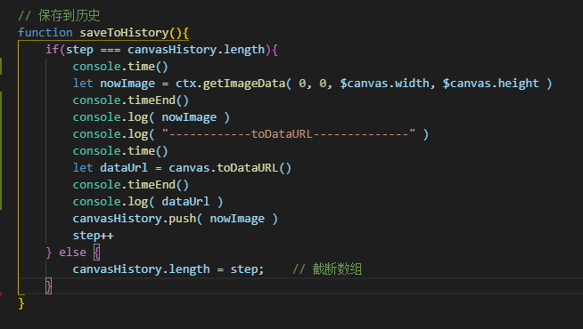
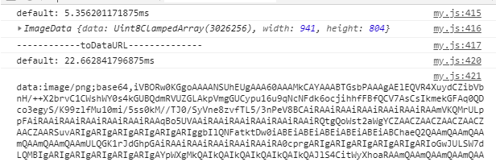
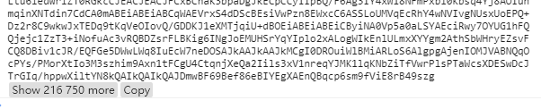
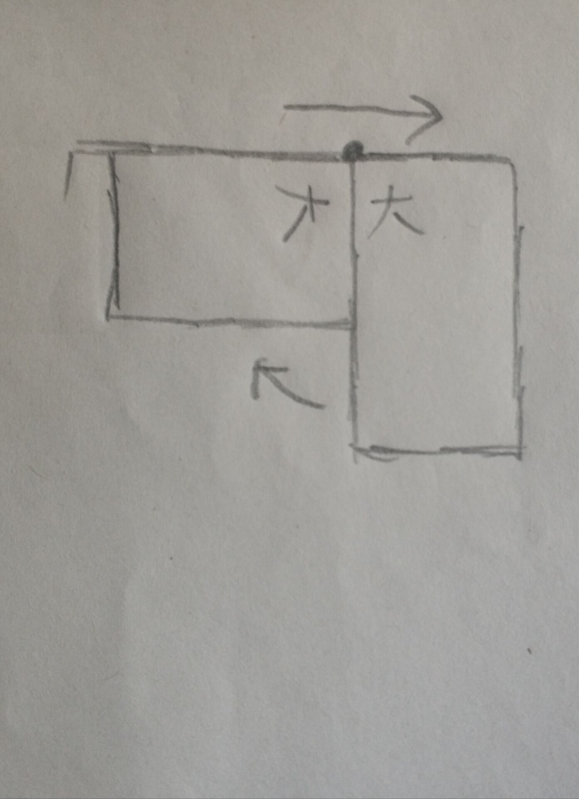

# 快到碗里来-画板
---

预览：[点击](https://curtaintan.github.io/drawing-board/)

## 前言：
---
之前学完canvas，一直想自己写一点东西，这两天终于完成了，开心！！


## 完成功能：
---
1. 绘画
2. 画直线
3. 截图
4. 旋转
5. 弹幕
6. 鼠标触碰弹幕，弹幕悬停
7. 撤销/前进
8. 设置画笔信息
9. 兼容移动端


### 功能截图：
----

<span></span>
<span></span>
<span></span>



## 前置说明
---
    如果你需要参考代码，你需要看下这里。
    因为功能复杂，标志的变量有接近10个之多，一下子可能很难看懂，所以我这里说明下我的开发流程，以及定义变量的顺序。

1. **功能顺序：**

画笔 → 定义画笔信息 → 橡皮檫 → 删除 → 撤销/前进 → 直线 → 截图 → 弹幕

2. **定义变量的顺序，以及作用：**

所有功能变量：

```js
var isDown = false                  // 标志鼠标是否按下      绘图三步和剪切三步走时，后面两个事件触发的标志
var points = []                     // 滑动时收集的点       绘画三步走时，为了时画的线光滑，记录点，减短画线的距离
var beginPoint = null               // 开始的点            绘画三步走时使用

----这三个为一组，画线三人组，为了让画的线更为光滑

var currentMenu = "icon-pen"        // 初始按钮            底部按钮选中的按钮
var currentColor = 0                // 初始颜色的index     颜色选择，默认第一个
var paintingModal = "pen"           // 画笔模式   line||pen||cut

----按钮功能三人组，按钮选中标记，颜色选中，画画的模式，切换前面画笔和画直线的模式

var lookModal = false               // 鼠标模式             按钮第一个功能，此模式不能绘画，只能看
var cuted = false                   // 标记裁剪时，是否已经裁剪       裁剪后，防止后续的操作再次触发裁剪操作 

----鼠标模式和剪切模式的定义

var animationTimer = null           // 弹幕动画的timer               动画的timer
var barrageArray = []               // 保存弹幕的数组
var globalPoint = { x : 0, y : 0 }  // canvas上鼠标的点        ---弹幕时使用

----弹幕三人组  globalPoint用来标记鼠标在canvas中的坐标，用于判断鼠标是否触碰到弹幕上

// 实现撤销和重做的功能
let canvasHistory = []                    // canvas数据，在每次画线和橡皮檫使用后保存数据
let step = 0                              // 画笔抬起的步数，清空时，步数也清空

----撤销/前进二人组，画笔抬起时，把画布信息用getImageData存入canvasHistory，用step完成前进和撤销的功能

var penAttibutes = {                       // 画笔数据，
    width : 2,
    lineCap : "round",
    lineJoin : "round",
    strokeStyle: "#000",
    fillStyle: "#000",
    globalCompositeOperation: "source-over",
    globalAlpha : 1
}

```

## 开发中遇到的难点与重点与解决方案：
----

1. 保存历史记录使用api对比

    我在写代码的时候有做过参考 **[这篇文章](https://juejin.im/post/5c7bf106e51d454b47558882)**，
    文章里用是canvas.toDataUrl的方式做的数据保存，评论里说这个数据保存不理想，
    其实我一开始的时候想的就是用ctx.getImageDaata的方式来做的，我也用这个两个api做了一个对比：

代码：



结果：




    可见，使用getImageData获取数据是时间是非常短的，并且获取到是画布像素数据，
    后续可以直接进行像素操作，从而不用再花时间再去获取画布信息，
    其次，getImageData获取到是数据是有数据结构的，这样在内存里面保存下来对内存更加友好，
    而使用toDataUrl方式保存下来的数据有21万行那么长的字符串，对内存并不友好。

    后面我还做了他们绘制到画布上的时间对比，他们的时间都在1ms内，到时每次putImageData都要快一点点，但是快这一点时间的意义并不大。

    toDataUrl也是有好处的，因为转置出来的是base64的字符串，所以他能够直接作为图片的src属性，让图片显示到页面。


2. 画直线

    如何画出一条直线？？当我做了撤销和前进的时候，我就把画板数据给存到canvasHistory里面了，
    这里刚好用到，鼠标移动是时候，先清空画布，再绘制保存到canvasHistory里最后那个数据，然后就是绘图三步走，就完成了。

    **注意：**这里一定要绘图三步走，或者在绘制前一定要用beginPath()重开一条路径，如果不重开路径，
    绘制时，会把前面的直线一同绘制出来，因为你一直是一条路径，所以下次绘制时，上次的点也要绘制一遍。

3. 图片旋转

    旋转很类似css3，但是，canvas的基点固定在左上角处，所以在旋转的时候，需要先用translate移动画板，可以画一下图，

下面是我画的图：




    问题： 当我画笔有rotate属性的时候，当前操作的putImageData不会成功，不知道为什么-----

4. 如何画出一条光滑的曲线

    用正常的画法画曲线是时候，画出的曲线不够光滑，
    所以我就参考了这篇文章 **[canvas进阶——如何画出平滑的曲线?](https://segmentfault.com/a/1190000016672567)**
    （其实我也想到了用二次贝塞尔曲线，在寻找更好的解决方案时，就找到这个方法了，这个方案更优），原理可以看原文。

5. 鼠标触摸弹幕

    因为canvas是无记忆性的，所以，你用isPointPath和isPointStroke时，是在当前绘画下才能检测。
    在使用isPointPath时，他只与path路径有关，意思就是，你用fillRect直接绘制一个矩形图形是不能检测的，
    只能检测rect()和pathTo等围起来的路径内。

    所以，这里我做了一个外挂路径-用rect()把每个弹幕框起来------哈哈--

6. 使用drawImage须知：

    drawImage有三种传参方式，三种方式出来的效果，在书写前可以先参考效果。

参考地址：[CanvasRenderingContext2D.drawImage](https://www.canvasapi.cn/CanvasRenderingContext2D/drawImage)

7. 兼容移动端

    当在移动端时，会存在移动端延时300ms的问题，因为移动端有双击放大功能，故存在300ms时间。

    我解决的方法是设置meta信息，禁止缩放，就可以防止300ms问题

    <meta name="viewport" content="width=device-width, initial-scale=1.0, maximum-scale=1.0, minimum-scale=1.0, user-scalable=no, target-densitydpi=device-dpi" />


## 结语：
---

    这个项目大概用了canvas的75%的api，还有像素操作和渐变等api还没用到。

    不知道有没有人看呢，

    如果你看到了这篇文章，希望对你有帮助。

    慢慢来，好好学习，要加油哦！
    
    与君共勉！！


### 参考材料：

- [手把手教你实现一个canvas智绘画板](https://juejin.im/post/5c7bf106e51d454b47558882)

参考了楼主项目的样式，但是所有样式都是我自己写的，嘻嘻，实现方式不一样哦。。

- [canvas进阶——如何画出平滑的曲线?](https://segmentfault.com/a/1190000016672567)

画一条光滑的曲线，不错哦。

- [canvas动画包教不包会](http://ghmagical.com/article/page/id/rf5VpT3YQPpN)

可以在这里把所有api的意义和作用和参数等都记下来-----

- [Canvas API中文文档首页地图](https://www.canvasapi.cn/)

canvas所有的api，当然你也可以去mdn看，其实都一样啦---

